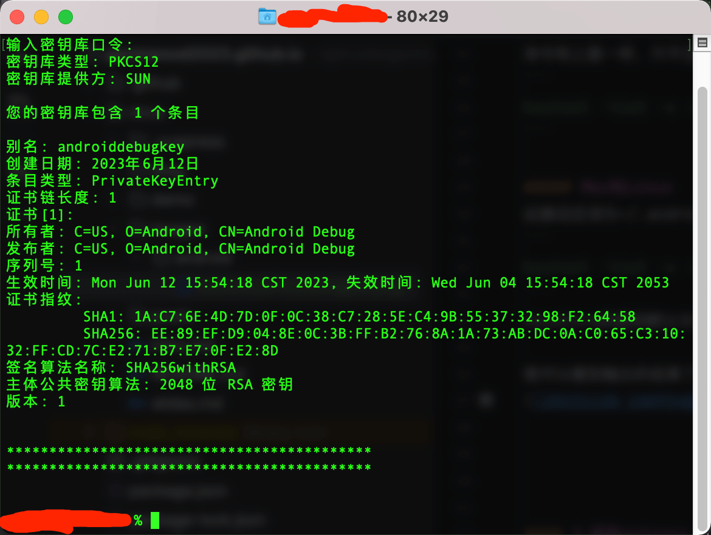

### 命令
```
keytool -list -v -keystore <path-to-production-keystore>
```

#### 1.获取debug（调试版）的sha1:
##### windows
调试版keystore默认在 **C:\User.android\debug.keystore（Windows下）**，
keystore的密码默认为 **android**

命令和上面一样，只不过把路径换成默认签名文件所在路径
```
keytool -list -v -keystore C:\***\.android\debug.keystore
```

##### Mac和Linux
此路径应该为~/.android/debug.keystore，示例：
```
keytool -list -v -keystore /Users/Custom Name/.android/debug.keystore
```
keystore的密码默认为**android**

输出的结果：



#### 2.获取release（正式版）的sha1:
```
keytool -list -v -keystore <path-to-production-keystore>
```
例如：
keystore放在 C:\android_projects\test.jks
```
keytool -list -v -keystore C:\android_projects\test.jks
```

### 错误提示及解决
keytool 错误: java.io.IOException: Invalid keystore format

#### 原因剖析
是jdk不一致。