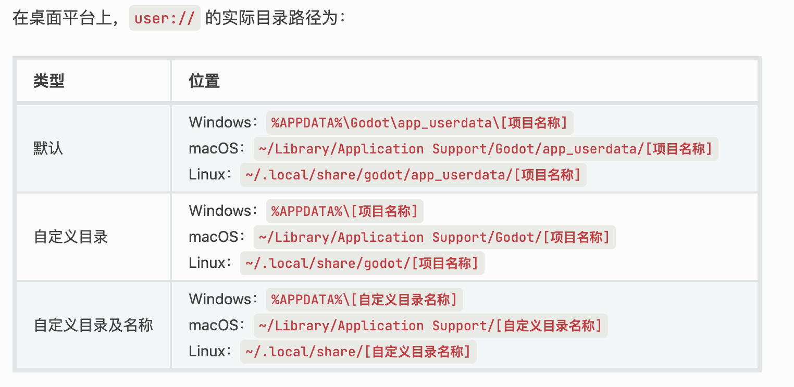

#### 需求：
1、存储简单的数据，像是玩家金币，等级等

2、可选择加密/不加密存储

3、可以正常获取存储的值


#### 参考：
[官网持久化用户数据文档](https://docs.godotengine.org/zh-cn/4.x/tutorials/io/data_paths.html#accessing-persistent-user-data-user
"持久化用户数据")

`user://`路径位置：



#### 实现：
用[ConfigFile](https://docs.godotengine.org/zh-cn/4.x/classes/class_configfile.html#class-configfile
"ConfigFile")
将数据存储到`user://storage.cfg`文件中

编写`LocalStorage.gd`脚本，设置为单例自动加载，命名为`LocalStorage`同时勾选`Enable`

代码如下：
```LocalStorage.gd
extends Node

# 创建新的 ConfigFile 对象。
var config 

# 是否加密存储
var is_encrypted = false

# 文件路径
var file_path = "user://storage.cfg"

# 加密key
var password = "secret_key"


func _ready():
	_set_password()
	config = ConfigFile.new()

func _set_password():
    # 明文转成base64
	password = Marshalls.utf8_to_base64(password)
	# base64转明文
	# print(Marshalls.base64_to_utf8(password))
	

# 设置数据
# 参数:
#   - section: String, 小节名 
#	- key: String, 键
#	- value: String, 值
# 返回值:
#   PackedStringArray, 字符串数组
func set_value(section:String,  key:String, value:Variant ):
	config.set_value(section, key, value)
	# 设置完成后保存
	save_to_file() 


# 返回指定小节和键的当前值。如果该小节或键不存在，则该方法返回后备值 default。
# 参数:
#   - section: String, 小节名 
#	- key: String, 键
#	- default： Variant， 默认值
# 返回值:
#   Variant
func get_value(section:String,  key:String, default:Variant):
	return config.get_value(section,key,default)
	

# 将其保存到文件中（如果已存在则覆盖）
# 参数:
#   - path: String, 文件路径 
# 返回值:
#   void
func save_to_file(path:String = file_path):
	if is_encrypted :
		config.save_encrypted_pass(path,password)
	else:
		config.save(path)


# 从文件加载数据
# 参数:
#   - path: String, 文件路径 
# 返回值:
#   void
func load_data(path:String = file_path):
	var err
	if is_encrypted:
		err = config.load_encrypted_pass(path, password)
	else:
		err = config.load(path)
	if err != OK:
		print("[waring]: fail to read file : " + path)


# 删除指定小节以及其中的所有键值对
# 参数:
#   - section: String, 小节名
# 返回值:
#   void
func erase_section(section:String):
	if config.has_section(section):
		config.erase_section(section)
		save_to_file()
	else:
		print("[waring]: no current section exists: ", section)


# 删除小节中的指定键。
# 参数:
#   - section: String, 小节名 
#   - key: String, 键名
# 返回值:
#   void
func erase_section_key(section:String, key:String):
	if key in get_section_keys(section):
		config.erase_section_key(section, key)
		save_to_file()
	else:
		print("[waring]: no current key exists: ", section," -> ", key)


# 返回指定小节中所有已定义键标识符的数组
# 参数:
#   - section: String, 小节名 
# 返回值:
#   PackedStringArray, 字符串数组 
func get_section_keys(section:String) -> PackedStringArray:
	if config.has_section(section):
		return config.get_section_keys(section)
	else:
		print("[waring]: no current section exists: ", section)
		return []


# 移除全部内容
# 参数:
#   无
# 返回值:
#   void
func clear():
	config.clear()
	save_to_file()
	

```

#### 使用
测试代码：
```angular2html
func _test():
    LocalStorage.set_value("Player1","name","lisi")
    LocalStorage.set_value("Player1","age","20")

    LocalStorage.load_data()
    var value = LocalStorage.get_value("Player1","name","NULL")
    print("value ： ",value)
    
    print("Player1 : ",LocalStorage.get_section_keys("Section"))

    LocalStorage.erase_section_key("Player1","age")
```
