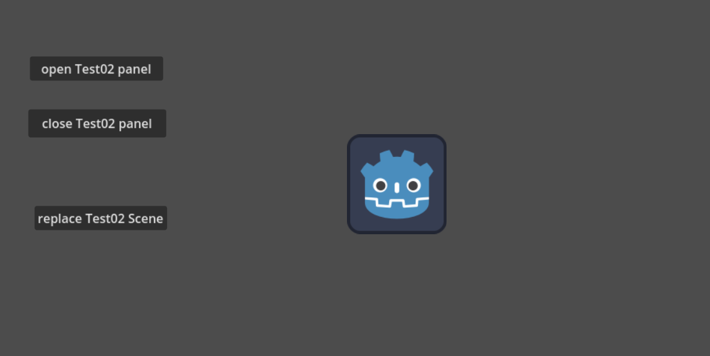

### 需求
1、任何场景或界面，可以直接调用UiManager中的方法
2、可以添加面板/场景，如果有_on_open方法则调用，并可传入任意参数
3、可以移除面板/场景，如果有_on_close方法则调用
4、可以切换场景

### 实现
#### 1、UIPanelItem.gd 定义一个面板/场景格式，包含一个名字和路径
``` UIPanelItem.gd
class_name UIPanelItem

var name: String
var path:String

# 构造函数
func _init(p_name: String, p_path: String):
	name = p_name
	path = p_path

```

#### 2、UIManager.gd 设置为单例自动加载，名字为UiManager，[如何设置请参考 (一)：创建单例自动加载.md](%28%E4%B8%80%29%EF%BC%9A%E5%88%9B%E5%BB%BA%E5%8D%95%E4%BE%8B%E8%87%AA%E5%8A%A8%E5%8A%A0%E8%BD%BD.md)
``` UIManager.gd
extends Node

var UIPanelItem = preload("res://UIPanelItem.gd")

# 当前场景
var current_scene = null

# 定义一个列表以跟踪显示的节点， key(name):value（path）格式
var show_node_list = {}

# 当节点第一次进入场景树时调用。
func _ready():
	var root = get_tree().root
	current_scene = root.get_child(root.get_child_count() - 1)


# 获取显示的节点列表
func get_show_node_list():
	return show_node_list


# 显示面板/场景
func show_panel(panel_item:UIPanelItem, params:Variant=null):
	if panel_item.name in show_node_list:
		print("[waring]: already add panel name: ",panel_item.name,", path: ",panel_item.path)
		return
	
	# 通过路径加载场景
	var scene = load(panel_item.path)
	# 实例化场景
	var node = scene.instantiate()
	# 添加节点
	add_child(node)
	# 将节点添加到显示的节点列表中
	show_node_list[panel_item.name] = node
	
	# 调用面板/场景的on_open函数
	if node.has_method("_on_open"):
		if params:
			node._on_open(params)
		else:
			node._on_open()


# 关闭面板/场景
func close_panel(panel_name:String):
	# 按名称在显示的节点列表中查找节点
	var node = null
	if panel_name in show_node_list:
		node = show_node_list[panel_name];
	if node == null:
		print("[waring]: not found panel name: ", panel_name)
		return
		
	## 调用面板/场景的_on_close函数
	if node.has_method("_on_close"):
		node._on_close()
	
	# 从显示的节点列表中删除该节点
	show_node_list.erase(panel_name)
	# 从UIManager中删除节点
	node.queue_free()


# 切换场景
func replace_scene(panel_item:UIPanelItem):
	# This function will usually be called from a signal callback,
	# or some other function in the current scene.
	# Deleting the current scene at this point is
	# a bad idea, because it may still be executing code.
	# This will result in a crash or unexpected behavior.

	# The solution is to defer the load to a later time, when
	# we can be sure that no code from the current scene is running:

	call_deferred("_deferred_goto_scene", panel_item.path)

func _deferred_goto_scene(path):
	# It is now safe to remove the current scene.
	current_scene.free()

	# Load the new scene.
	var s = ResourceLoader.load(path)

	# Instance the new scene.
	current_scene = s.instantiate()

	# Add it to the active scene, as child of root.
	get_tree().root.add_child(current_scene)

	# Optionally, to make it compatible with the SceneTree.change_scene_to_file() API.
	get_tree().current_scene = current_scene

```
#### 3、使用
##### 1、新建Test01.tscn和Test02.tscn场景

Test01.tscn


Test02.tscn


##### 2、新建Test01.gd和Test02.gd脚本，分别绑在对应场景的根节点上

##### 3、使用

###### Test01.gd

1）、`open Test02 panel` 按钮事件中的代码
```
var params = {"a":"v_a","b":"v_b"}
params.c = "v_c"
var panel_item = UIPanelItem.new("Test02", "res://Test02.tscn")
# 无参
# UiManager.show_panel(panel_item)
# 传参
UiManager.show_panel(panel_item, params) 
```

2）、`close Test02 panel` 按钮事件中的代码
```
UiManager.close_panel("Test02")
```

3、`replace Test02 Scene` 按钮事件中的代码
```
var panel_item = UIPanelItem.new("Test02", "res://Test02.tscn")
UiManager.replace_scene(panel_item)
```

###### Test02.gd
_on_open：打开面板的时候调用，接收参数则可以定义为 `func _on_open(params)`，不接受参数定义为 `func _on_open()`
_on_close：关闭面板的时候调用
```
func _on_open():
	print("Test02 on_open")
	#if params != null:
		#print(params)
		#print(params["a"], ", ", params.a)
		#print(params.c)
	
func _on_close():
	print("Test02 on_close")
```