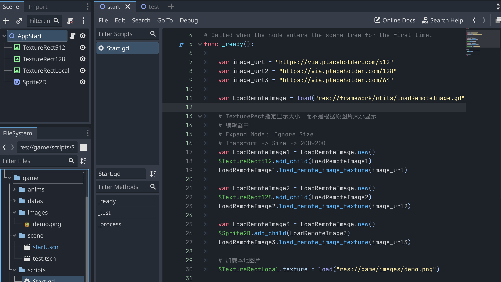

### 需求
1、实现`TextureRect`和`Sprite2D`组件加载远程图片

2、固定节点显示大小，不因图片大小而改变


### 实现
1、大小：

通过在编辑器中放置占位素材，调节大小，拼完整UI

1）、`TextureRect`在编辑器中，通过设置`Expand Mode`为`Ignore Size`和`Transform`中`Size`设置大小，可实现大小固定

2）、`Sprite2D`在编辑其中，通过设置`Scale`来实现固定大小


2、远程加载texture

编写`LoadRemoteImage.gd`脚本

```LoadRemoteImage
extends Node

# 定义信号
#signal load_remote_image_texture_single(texture: Texture)

func _ready():
	pass


func _init():
	pass


func load_remote_image_texture(image_url: String) -> void:
	# 创建一个 HTTP 请求节点并连接其完成信号。
	var http_request = HTTPRequest.new()
	add_child(http_request)
	http_request.request_completed.connect(self._http_request_completed)
	
	# 执行一个 HTTP 请求。下面的 URL 将写入作为一个 PNG 图像返回。
	var error = http_request.request(image_url)
	if error != OK:
		push_error("在HTTP请求中发生了一个错误",error)


# 当 HTTP 请求完成时调用。
func _http_request_completed(result, response_code, headers, body):
	if result != HTTPRequest.RESULT_SUCCESS:
		push_error("无法下载图像。尝试一个不同的图像")

	var image = Image.new()
	var error = image.load_png_from_buffer(body)
	if error != OK:
		push_error("无法加载图像")

	var texture = ImageTexture.create_from_image(image)
	#emit_signal("load_remote_image_texture_single", texture)
	get_parent().texture = texture
	
```

### 使用
start.tscn场景和Start.gd脚本，如下



在`_ready`函数中，给`$TextureRect512`，`$TextureRect128`，`$Sprite2D`绑定`LoadRemoteImage`脚本，
之后调用`load_remote_image_texture`加载远程图片，即可正常显示

```
var image_url = "https://via.placeholder.com/512"
var LoadRemoteImage = load("res://LoadRemoteImage.gd")	

# TextureRect指定显示大小，而不是根据原图片大小显示
# 编辑器中 
# Expand Mode： Ignore Size
# Transform -> Size -> 200*200
var LoadRemoteImage1 = LoadRemoteImage.new()
$TextureRect512.add_child(LoadRemoteImage1)
LoadRemoteImage1.load_remote_image_texture(image_url)
```


加载本地图片，用法:
```
$TextureRectLocal.texture = load("res://game/images/demo.png")
```