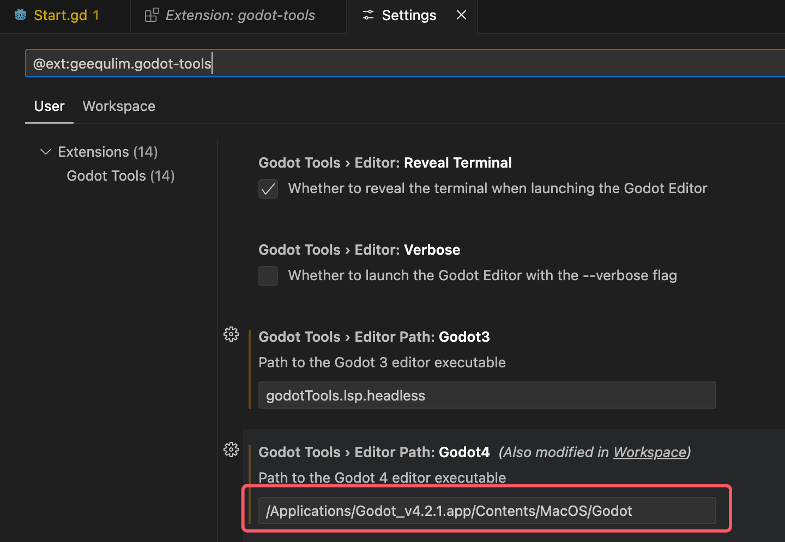
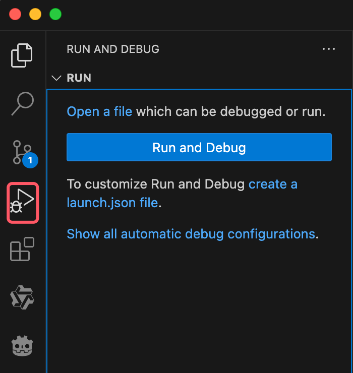

### VSCode设置：

1、VSCode中下载godot-tool插件


2、下载完插件后，点击设置,选择`Extension Settings`


3、输入godot安装路径`/Applications/Godot_v4.2.1.app/Contents/MacOS/Godot`，windows指定到.exe文件



即可在当前项目`.vscode`目录下生成`settings.json`文件
```
{
    "godotTools.editorPath.godot4": "/Applications/Godot_v4.2.1.app/Contents/MacOS/Godot"
}
```

4、选择`Run and Debug`



点击`create a launch.json file`选择`GDScript Godot Debug`


即可在当前项目`.vscode`目录下生成`launch.json`文件
```
{
    // Use IntelliSense to learn about possible attributes.
    // Hover to view descriptions of existing attributes.
    // For more information, visit: https://go.microsoft.com/fwlink/?linkid=830387
    "version": "0.2.0",
    "configurations": [
        {
            "name": "GDScript: Launch Project",
            "type": "godot",
            "request": "launch",
            "project": "${workspaceFolder}",
            "debug_collisions": false,
            "debug_paths": false,
            "debug_navigation": false,
            "additional_options": ""
        }
    ]
}
```
完成以上设置，则可以直接在`VSCode`中`F5`运行`godot`项目

### Godot设置：
实现：双击gd脚本，用VSCode打开

编辑器->编辑器设置->文本编辑器->外部


使用外部编辑器：选择启用

可执行文件路径：注意路径指定到Electron文件，windows指定到.exe文件

`
/Applications/Visual Studio Code.app/Contents/MacOS/Electron
`

执行参数：

`
{project} --goto {file}:{line}:{col}
`

完成后，双击脚本即可用VSCode打开