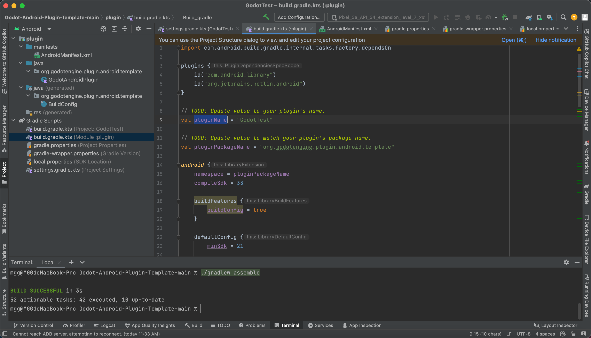
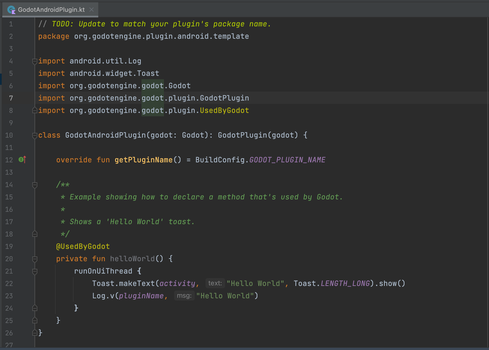
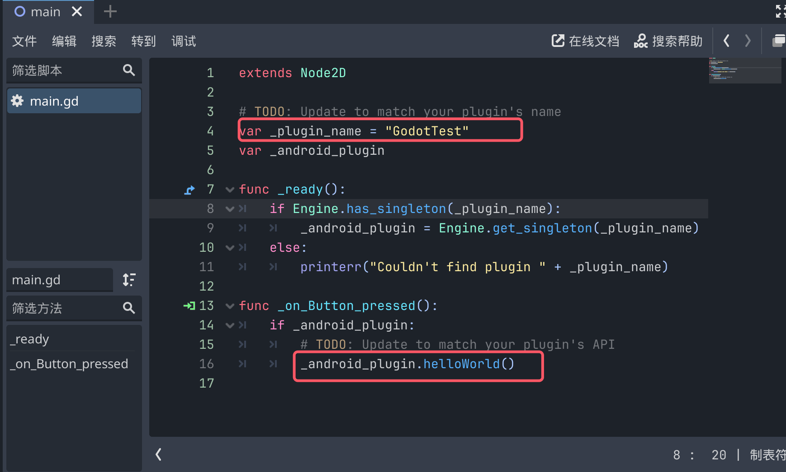
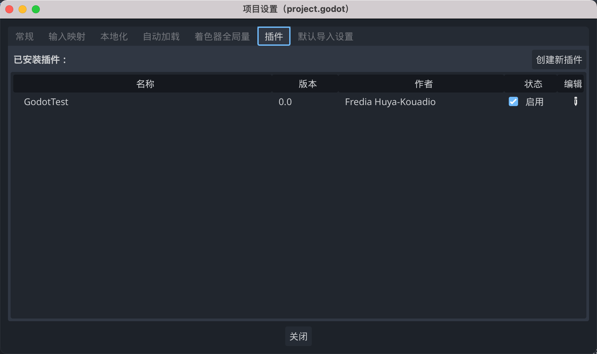

实现内容：
点击按钮，调用anroid层面代码，弹出一个android层的hello world提示

1、下载Godot Android插件示例代码

[插件示例代码地址](https://github.com/m4gr3d/Godot-Android-Plugin-Template)

[官方说明文档](https://docs.godotengine.org/zh-cn/4.x/tutorials/platform/android/android_plugin.html)

2、导入到Android Studio



3、修改`build.gradle.kts(Module:plugin)`中`pluginName`和`pluginPackageName`
```
// TODO: Update value to your plugin's name.
val pluginName = "GodotTest"

// TODO: Update value to match your plugin's package name.
val pluginPackageName = "org.godotengine.plugin.android.template"
```

4、修改`BuildConfig.java`中的`GODOT_PLUGIN_NAME`和`LIBRARY_PACKAGE_NAME`等
```
ublic final class BuildConfig {
    public static final boolean DEBUG = Boolean.parseBoolean("true");
    public static final String LIBRARY_PACKAGE_NAME = "org.godotengine.plugin.android.template";
    public static final String BUILD_TYPE = "debug";
    // Field from default config.
    public static final String GODOT_PLUGIN_NAME = "GodotTest";
}
```
5、修改`GodotAndroidPlugin.java代码`



修改第一行的`package`

底下的`helloWorld`方法是，GDScript中要调用的。可根据自身需求实现其它方法。

6、修改`Godot-Android-Plugin-Template-main/plugin/export_scripts_template/plugin.cfg`
包括：插件名字，插件描述，作者，版本，脚本
```
[plugin]

name="GodotTest"
description="Template used to build a Godot Android plugin"
author="Fredia Huya-Kouadio"
version="0.0"
script="export_plugin.gd"
```
7、修改`Godot-Android-Plugin-Template-main/plugin/export_scripts_template/export_plugin.gd`
主要是`_plugin_name`
```
@tool
extends EditorPlugin

# A class member to hold the editor export plugin during its lifecycle.
var export_plugin : AndroidExportPlugin

func _enter_tree():
	# Initialization of the plugin goes here.
	export_plugin = AndroidExportPlugin.new()
	add_export_plugin(export_plugin)


func _exit_tree():
	# Clean-up of the plugin goes here.
	remove_export_plugin(export_plugin)
	export_plugin = null


class AndroidExportPlugin extends EditorExportPlugin:
	# TODO: Update to your plugin's name.
	var _plugin_name = "GodotTest"

	func _supports_platform(platform):
		if platform is EditorExportPlatformAndroid:
			return true
		return false

	func _get_android_libraries(platform, debug):
		if debug:
			return PackedStringArray([_plugin_name + "/bin/debug/" + _plugin_name + "-debug.aar"])
		else:
			return PackedStringArray([_plugin_name + "/bin/release/" + _plugin_name + "-release.aar"])

	func _get_name():
		return _plugin_name
```

8、在`Godot-Android-Plugin-Template-main`目录下执行
```
./gradlew assemble
```
9、在Godot编辑器中打开demo项目
`Godot-Android-Plugin-Template-main/plugin/demo`
`main.gd`代码如下，包括插件名字和调用的android代码的方法名


10、选择`项目`->`安装Android构建模板`

11、将插件下的`addone`目录，复制到项目目录下，选择`项目`->`项目设置`->`插件`->`启用`


12、打包测试，
`项目`->`导出`->`添加Android`->勾选`使用Gradle构建`

13、解决apk包体问题：

打开`android/build/AndroidManifest.xml`,在`application`标签内添加`android:extractNativeLibs="true"`


14、补充`GodotAndroidPlugin`代码，获取手机MCC
~~打包时需要`Read Phone State`权限~~
```
    @UsedByGodot
    private fun showToast(str: String) {
        runOnUiThread {
            Toast.makeText(activity, str, Toast.LENGTH_LONG).show()
            Log.v(pluginName, str)
        }
    }

    @UsedByGodot
    private fun getMcc(): Int {
        var mcc = -1
        val telephonyManager = activity?.getSystemService(Context.TELEPHONY_SERVICE) as TelephonyManager
        val networkOperator = telephonyManager.networkOperator
        if (!TextUtils.isEmpty(networkOperator)) {
            mcc = networkOperator.substring(0, 3).toInt()
        }
        Log.i("NetworkOperatorMCC:", "" + mcc)
        return mcc
    }
```
跳转到网页
```
@UsedByGodot
private fun openLink(url: String){
    runOnUiThread {
        val intent = Intent(Intent.ACTION_VIEW)
        intent.data = Uri.parse(url)
        activity?.startActivity(intent)
    }
}

```

复制文本到粘贴板；从粘贴板获取文本
```
@UsedByGodot
private fun copyStr2Clipboard(str: String){
    var clipManager = activity?.getSystemService(Context.CLIPBOARD_SERVICE) as ClipboardManager;
    val myClip = ClipData.newPlainText("text", str)
    clipManager.setPrimaryClip(myClip)
}

@UsedByGodot
private fun getStr4Clipboard(): String{
    var result = "";
    var clipboardManager = activity?.getSystemService(Context.CLIPBOARD_SERVICE) as ClipboardManager;
    // 检查剪贴板是否有内容
    if (clipboardManager.hasPrimaryClip()) {
        // 获取剪贴板的内容
        val clip = clipboardManager.primaryClip
        // 确保剪贴板内容不为空且有至少一条剪贴板内容
        if (clip != null && clip.itemCount > 0) {
            // 获取第一条剪贴板内容
            val clipItem = clip.getItemAt(0)
            // 将剪贴板内容转换为字符串
            val clipText = clipItem.text?.toString()
            // 判断剪贴板内容是否为空
            if (clipText.isNullOrEmpty()) {
                println("剪贴板内容为空")
            } else {
                result = clipText;
            }
        } else {
            println("剪贴板为空或无内容")
        }
    }
    return result;
}

```