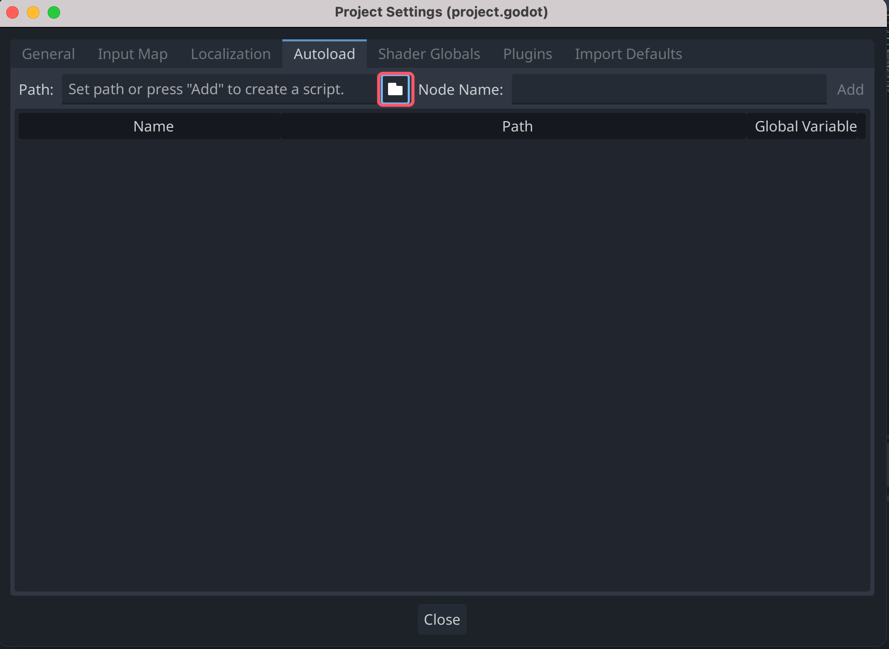

### 原理
自动加载脚本时，会创建一个 Node 并把脚本附加上去。加载其它任何场景前，这个节点就会被加到根视图上。

### 自动加载

要自动加载场景或脚本，请从菜单中选择“项目(Project)”>“项目设置(Project Settings)”，然后切换到“自动加载(Autoload)”选项卡。


你可以在这里添加任意数量的场景或脚本。列表中的每个条目都需要一个名称，会被用来给该节点的 name 属性赋值。使用上下箭头键可以操纵将条目添加到全局场景树时的顺序。与普通场景一样，引擎读取这些节点的顺序是从上到下的。


运行场景树，就会看到自动加载的节点出现

访问自动加载对象（脚本、场景）的方式和访问场景树中的任何其他节点是一样的。

示例
```godot
var uiManager = get_node("/root/UiManager")
uiManager.func_test()
```

如果在Autoload面板中，选中Enable (默认选中)，则可以直接在 GDScript 中访问单例，而不需要 get_node()：

示例
```godot
UiManager.func_test()
```