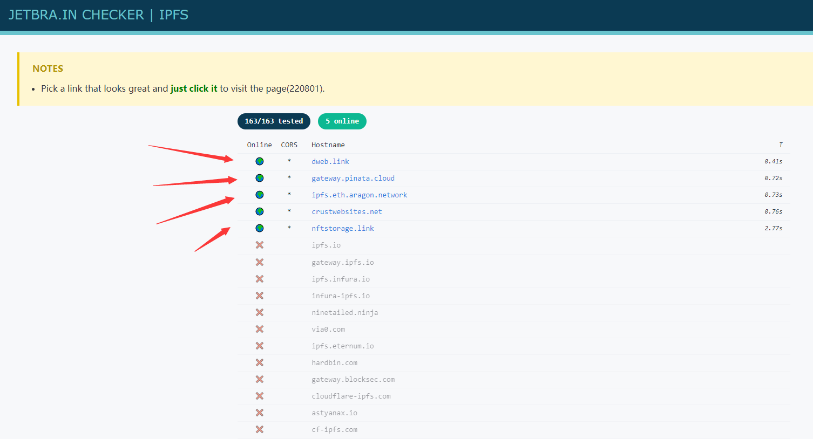
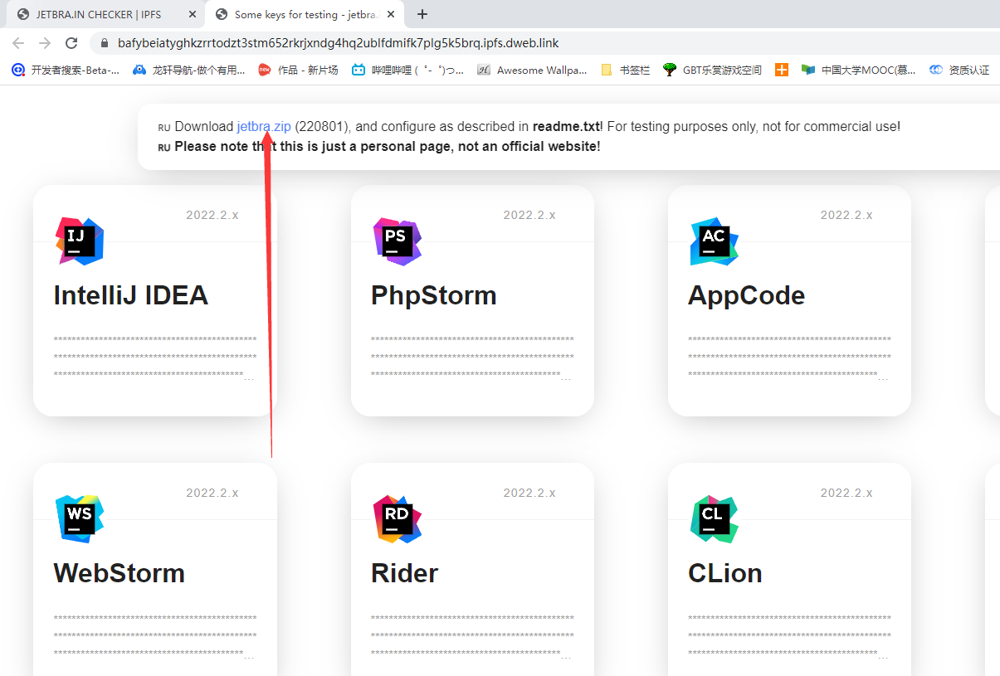
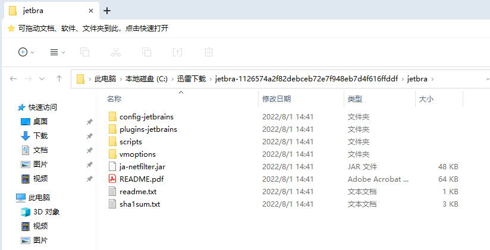
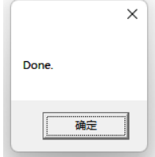
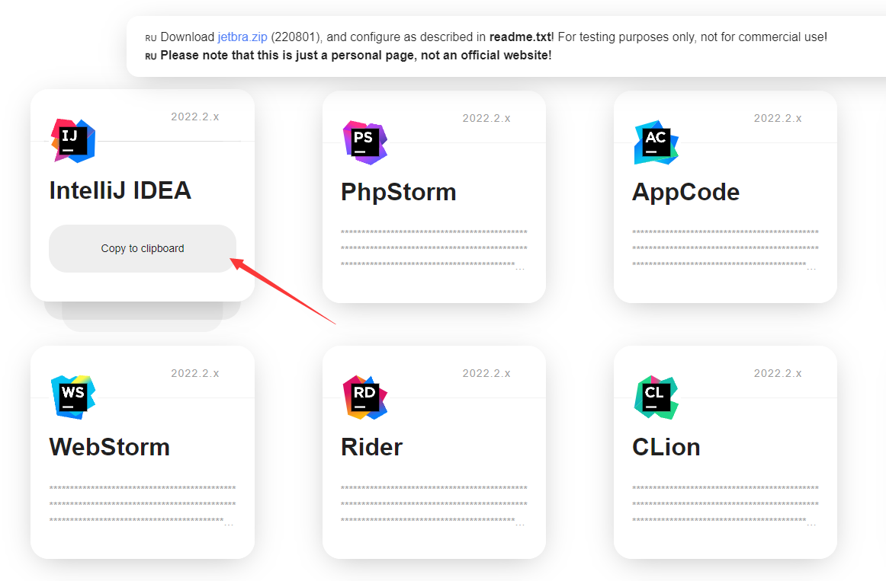
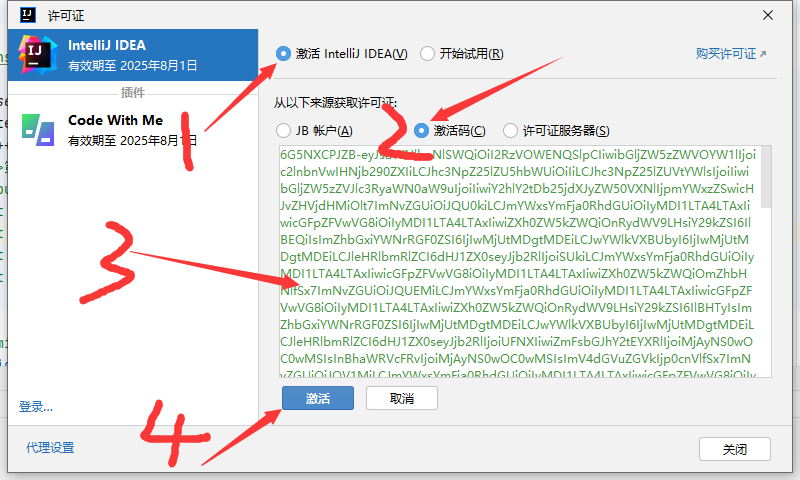
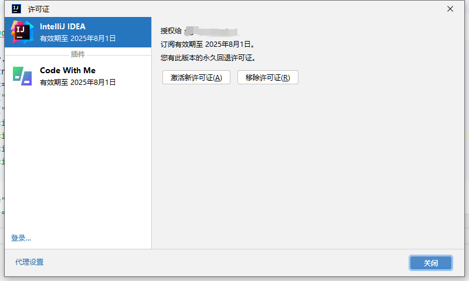

1、打开网站 https://jetbra.in/s 

2、打开网站后，选择状态为**Online**的网址，并点击进去（如图所示）

3、点击网页上边的这个地方，随后会让下载一个压缩包

4、解压刚才下载的压缩包 到一个文件夹里，最好自己建立一个文件夹，这个文件夹里的文件不能删除，删除了的话，激活就会失效.（如图为解压后的文件夹）

5、打开**scripts**文件夹，并双击**install-current-user.vbs**这个文件，然后等待，大约十秒左右，会出现成功的提示框。

6、回到刚才的网址，找到你要激活的软件，在下半部分点击左键就可以自动复制激活码

7、打开电脑上要激活的软件，点击如图所示的按钮，粘贴刚刚复制的激活码，点击激活，即可激活

**注意： 如果已经激活过Jetbrain系列的其中一个软件，再下载其他Jetbrain软件的时候，只需要执行第6步之后的操作**