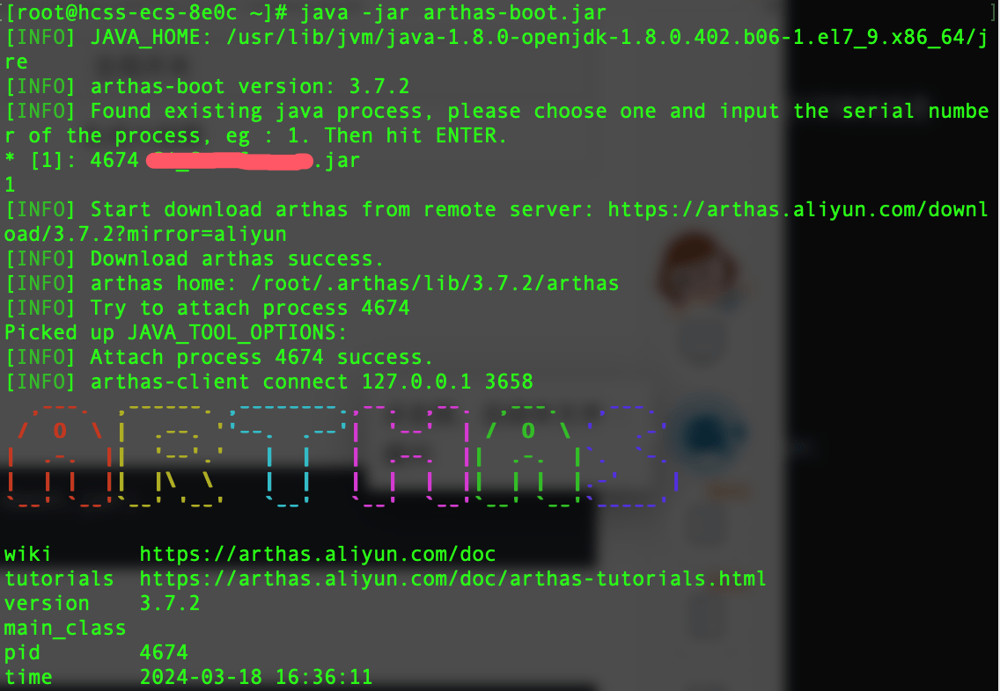

方法一：

1、top 命令定位应用进程 pid

2、top -Hp [pid] 定位应用进程对应的线程 tid

3、printf "%x\n" [tid] 将tid转换为十六进制

4、jstack [pid] | grep -A 10 [tid的十六进制] 打印堆栈信息

5、根据堆栈信息分析问题

方法二：

借助阿里云工具[Arthas](https://arthas.aliyun.com/doc/quick-start.html#_1-%E5%90%AF%E5%8A%A8-math-game)

1、下载arthas-boot.jar

wget https://arthas.aliyun.com/arthas-boot.jar;

2、运行 

java -jar arthas-boot.jar

根据自己情况选择java进程：此处选 1

3、查看 dashboard

输入dashboard，按回车/enter，会展示当前进程的信息，按ctrl+c可以中断执行。

4、退出 arthas

如果只是退出当前的连接，可以用quit或者exit命令。Attach 到目标进程上的 arthas 还会继续运行，端口会保持开放，下次连接时可以直接连接上。

如果想完全退出 arthas，可以执行stop命令。