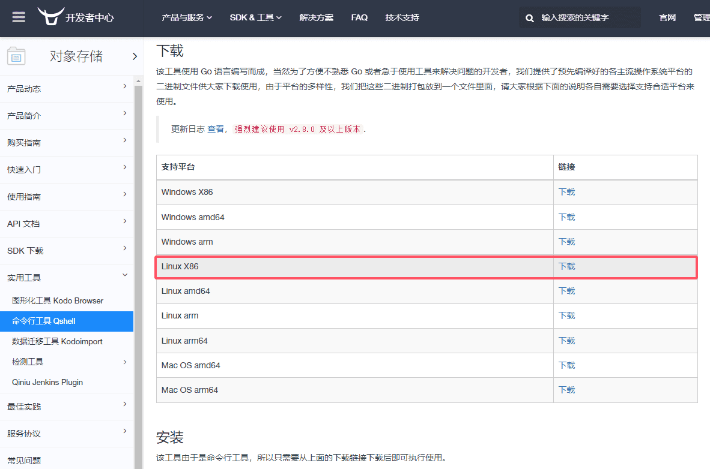

### 需求

每天凌晨3点，备份数据库到七牛云


### 实现
#### 一、编写数据备份脚本，上传到七牛云 `/usr/local/bin/backup_mysql.sh`，位置可随意，并设置执行权限`chmod +x backup_mysql.sh`
```
#!/bin/bash

# MySQL 配置
DB_USER="数据库用户名"
DB_PASSWORD="数据库密码"
DB_NAME="数据库名字"
BACKUP_DIR="本机备份地址"
DATE=$(date +%F)
BACKUP_FILE="$BACKUP_DIR/${DB_NAME}_$DATE.sql.gz"


# 七牛云配置
QINIU_BUCKET_NAME="your_bucket_name"


# 创建备份目录（如果不存在）
mkdir -p $BACKUP_DIR

# 备份 MySQL 数据库
mysqldump -u $DB_USER -p$DB_PASSWORD $DB_NAME | gzip > $BACKUP_FILE


# 上传到七牛云
# 注意：你需要安装并配置七牛云的命令行工具 `qshell` 
# --overwrite 表示覆盖上传

# 使用 qshell 工具
qshell rput $QINIU_BUCKET_NAME "七牛云桶内文件夹路径/${DB_NAME}_$DATE.sql.gz" $BACKUP_FILE --overwrite

# 处理错误和清理本地文件（可选）
if [ $? -eq 0 ]; then
  echo "Backup and upload successful"
  rm -f $BACKUP_FILE
else
  echo "Backup or upload failed"
fi
```

#### 二、设置定时任务

使用 `cron` 设置每天凌晨3点执行备份脚本，可通过 `crontab -e` 命令添加；也可通过修改文件添加，文件位置 `/var/spool/cron/crontabs`

`crontab -e`

添加以下行来调度备份任务：

`0 3 * * * /usr/local/bin backup_mysql.sh`

1）、/usr/local/bin： 脚本文件所在的路径

查看`crontab`设置:

`crontab -l`

#### 三、配置七牛云上传

##### 1、安装 `qshell` 工具

[下载地址](https://developer.qiniu.com/kodo/1302/qshell) 

通过 `lscpu` 查看 `Architecture` 选择合适的版本，这里下载的是 `qshell-v2.13.0-linux-386.tar.gz`



##### 2、下载后将 `qshell-v2.13.0-linux-386.tar.gz` 上传至服务器 `/usr/local/bin/` 目录下

##### 3、解压缩

`tar -zxvf qshell-v2.13.0-linux-386.tar.gz`

##### 4、配置  `qshell` 工具，输入你的七牛云账户信息：

`qshell account your_access_key your_secret_key your_name`

1）、your_access_key：访问KEY，从`个人中心`->`秘钥管理`里获取，没有的话创建秘钥。

2）、your_secret_key： 访问秘钥，从`个人中心`->`秘钥管理`里获取。

3）、your_name：七牛云账户名

##### 5、创建一个新的 `qshell` 配置文件，并将其上传配置为你的桶：

`qshell bucket  your_bucket_name  http://your_bucket_domain/`

1）、your_bucket_name： 桶名字

2）、your_bucket_domain： 桶外链域名

##### 6、使用 `qshell` 工具的 `rput` 命令将文件上传到七牛云。

#### 四、验证备份和上传
##### 运行脚本以确保备份和上传过程正常工作：
`backup_mysql.sh`

正常的话，已经备份到七牛云对应的桶里。